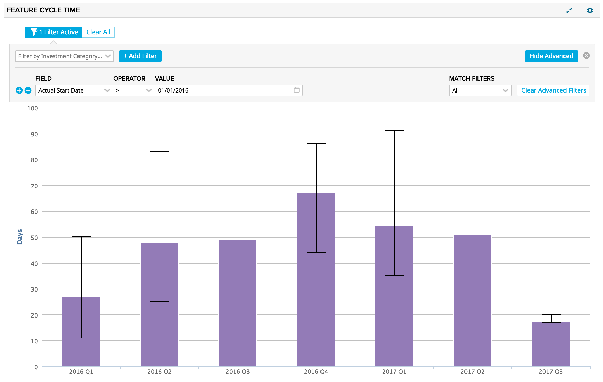
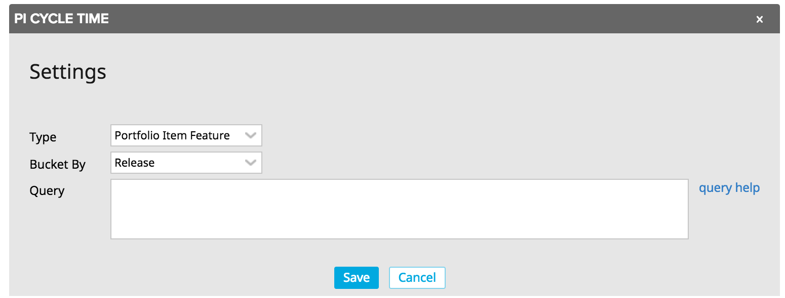

# PI Cycle Time Chart

This app plots the cycle time of portfolio items.  This metric is calculated as the difference between the ActualEndDate and ActualStartDate rollup fields for each included portfolio item.  The median cycle times are plotted as columns with whiskers included for the 25th and 75th percentiles.

The app can be configured for any level of the portfolio item hierarchy and the x-axis granularity is configurable as well.  This app includes the standard filtering component to enable further slicing and dicing of data.

## Installation and Settings
The app is installed as a Custom HTML App ([see help documentation](https://help.rallydev.com/custom-html))
Once the app is installed, use the gear menu on the app panel and select "Edit App Settings".

####  Type
Pick the Portfolio Item type you'd like to chart.  Defaults to the lowest level PI.

#### Bucket By
Pick the timeframe for which to generate values along the x-axis.  Available options include month, quarter and year.  Release is also available if the lowest level PI type is selected above.

#### Query
In addition to the advanced filtering component in the app, you can write your own complex filter queries. [Extensive documentation](https://help.rallydev.com/grid-queries?basehost=https://rally1.rallydev.com) is available. This might be useful if you want to always limit the chart to certain complex criteria.
